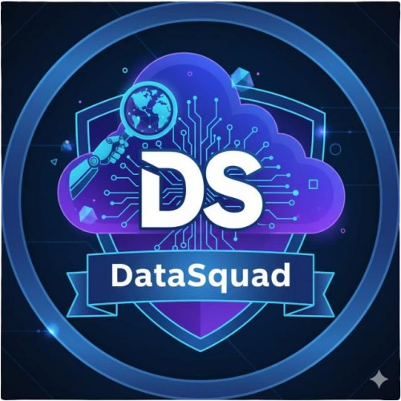

# API 2026 - DATASQUAD: Sistema de Gestão Acadêmica
Faculdade de Tecnologia de São José dos Campos - Professor Jessen Vidal

#

      
      <h2 align="center"> Data Squad </h2>

  | <a href ="#desafio"> Desafio</a>  |
  <a href ="#solucao"> Solução</a>  |   
  <a href ="#backlog"> Backlog do Produto</a>  |
  <a href ="#dor">DoR</a>  |
  <a href ="#dod">DoD</a>  |
  <a href ="#sprint"> Cronograma de Sprints</a>  |
  <a href ="#tecnologias">Tecnologias</a> |
  <a href ="#link">Link para Documentação</a>  | 
  <a href ="#equipe"> Equipe</a> |

> Status do Projeto: Em produção  🛠

##  Desafio 
O registro de atividades no sistema SIGA é fragmentado e ineficiente, exigindo que docentes naveguem por módulos desconexos para lançar uma única aula. Essa descentralização eleva a carga administrativa e compromete a integridade dos dados acadêmicos.

##  Solução 
Desenvolvemos uma aplicação JavaFX que centraliza a gestão acadêmica para professores e coordenadores, permitindo o controle de temas e planejamentos em uma interface única. O diferencial do sistema é a geração automática de cronogramas, que processa os parâmetros do coordenador e os temas definidos pelo docente para produzir, de forma instantânea, o planejamento semestral completo. A solução elimina o trabalho manual e garante um fluxo de dados contínuo, rastreável e otimizado para o registro oficial.

---

##  Backlog do Produto 
| Rank | Prioridade | User Story | Estimativa | Sprint |
| ---- | ---------- |------------|------------|--------|
| 1    | Alta       | Como professor, quero que a tabela do semestre seja montada automaticamente, para não precisar gastar horas organizando manualmente as aulas.         | 3      | 1      |
| 2    | Alta       | Como professor, quero separar os planejamentos por curso e por semestre, para não confundir turmas diferentes.                                        | 2       | 1      |
| 3    | Media      | Como professor, quero informar os temas que preciso ensinar, para que a tabela seja montada usando esses assuntos.                                    |            | 2      |
| 4    | Media      | Como professor, desejo que o sistema impeça o agendamento de avaliações em períodos restritos, para garantir que o planejamento ocorra sem conflitos. |            | 2      |
| 5    | Media      | Como professor, quero dizer quantas aulas no mínimo e no máximo cada tema deve ter, para garantir que todos os assuntos importantes sejam ensinados.  |            | 2      |
| 6    | Media      | Como professor, quero indicar se um tema precisa ser ensinado antes de outro, para evitar que os alunos vejam um assunto sem entender o anterior.     |            | 2      |
| 7    | Media      | Como professor, quero indicar quais temas são opcionais, para que eles apareçam apenas se houver tempo no semestre.                                   |            | 2      |
| 8    | Media      | Como professor, quero que dias sem aula sejam ignorados automaticamente, para evitar erros no planejamento.                                           |            | 2      |
| 9    | Media      | Como professor, quero que o calendário do semestre seja considerado, para que datas especiais não recebam aula.                                       |            | 2      |
| 10   | Media      | Como professor, quero poder ajustar manualmente alguma aula depois que a tabela estiver pronta, caso eu queira mudar algo.                            |            | 2      |
| 11   | Media      | Como professor, quero que o calendário já reconheça automaticamente feriados e possíveis emendas, para que eu não precise verificar isso manualmente. |            | 2      |
| 12   | Media      | Como coordenador, quero acompanhar os planejamentos dos professores do curso, para entender como cada disciplina está organizada.                     |            | 2      |
| 13   | Baixa      | Como professor, quero organizar meus temas por matéria, para não misturar conteúdos diferentes.                                                       |            | 3      |
| 14   | Baixa      | Como professor, quero que o planejamento mostre quantas aulas de cada tema foram distribuídas, para eu conferir se tudo ficou equilibrado.            |            | 3      |
| 15   | Baixa      | Como professor, quero receber um aviso quando algum tema estiver com poucas aulas, para não esquecer de ensinar algo importante.                      |            | 3      |
| 16   | Baixa      | Como professor, quero receber um aviso quando um tema estiver com aulas demais, para evitar exageros.                                                 |            | 3      |
| 17   | Baixa      | Como professor, quero que o planejamento sugira uma ordem inteligente para os temas, para facilitar o aprendizado dos alunos.                         |            | 3      |
| 18   | Baixa      | Como professor, quero poder guardar planejamentos antigos, para usar como base em semestres futuros.                                                  |            | 3      |

---

## DoR - Definition of Ready 

* User Story clara, objetiva e focada no usuário.
* Critérios de aceitação definidos.
* Subtarefas identificadas a partir da User Story.
* Protótipos das telas disponíveis.
* Estrutura inicial do banco de dados definida.
* Tecnologias definidas.
* Sem dependências bloqueadoras.
* Responsáveis definidos.

## DoD - Definition of Done 

* Código implementado e versionado no GitHub.
* Funcionalidade implementada e funcional na interface.
* Integração entre componentes/telas funcionando.
* Testes manuais realizados.
* Nenhum bug crítico conhecido.
* Documentação atualizada (README, Sprints, etc.)
* Funcionalidade validada pelo Product Owner.

---

## Cronograma de Sprints   

Sprint | Previsão | Status|
|------|--------|------|
|Sprint 01 | 16/03/2026 | em progresso | 
|Sprint 02|  13/04/2026| a fazer |
|Sprint 03| 11/05/2026 | a fazer 

---

## Tecnologias  

<h4 align="center"> 
       
       
       
       
       
       
       
       
</h4>

---

##  Link para as documentações 

- [Manual de Instalação](docs/manual/instalação.md)
- [Manual do Usuário](docs/manual/usuário.md)
- [Relatório Sprint 1](docs/sprint/relatorio_sprint1.md)

---

# Equipe
| Função | Nome | Github |
|--------|------|--------|
| Product Owner | Rubens Ferreira Venancio |  |
| Scrum Master | Guilhermina Moreira D'Onofrio |    |
| Team Member  | Breno Souza de Andrade |  |
| Team Member  | Matheus Henrique Ambrósio do Nascimento |  |
| Team Member  | Maria Clara Prado Farkas |  |
| Team Member  | João Victor Medeiros Gallina |  |
| Team Member  | Victor Trajai Pereira Ribeiro |  |
| Team Member  | Wanderson Ricardo dos Santos |  |

